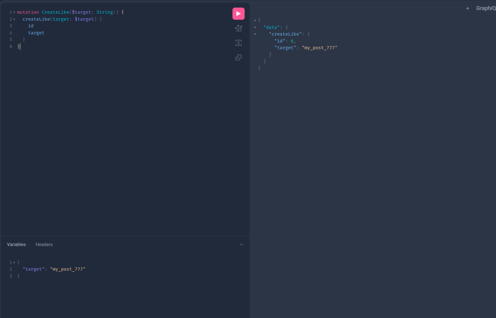
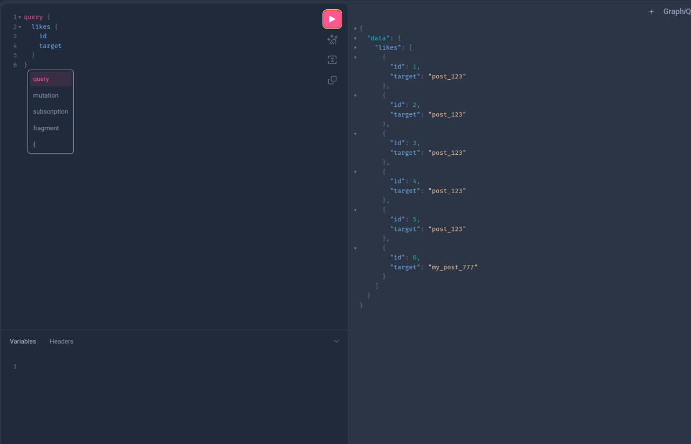
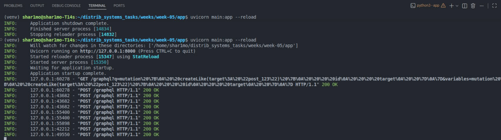

# Вопросы для самопроверки

1. В чем главное концептуальное отличие GraphQL от REST?

- Главное отличие GraphQL от REST — клиент сам выбирает, какие поля ему нужны, и получает ровно эти данные через один эндпоинт, а не множество фиксированных REST-эндпоинтов.

2. Что такое Schema Definition Language (SDL)?

- Schema Definition Language (SDL) — это язык описания схемы GraphQL: типы данных, поля, запросы и мутации.

3. Чем Query отличается от Mutation? Могут ли они выполняться параллельно?

- Query vs Mutation — Query читает данные (аналог GET), Mutation изменяет данные (аналог POST/PUT/DELETE). Query и Mutation могут выполняться отдельно; обычно Query можно выполнять параллельно, Mutation — последовательно.

4. Что такое "резолвер" (resolver) и кто его вызывает?

- Резолвер (resolver) — это функция, которая возвращает данные для конкретного поля в схеме. Его вызывает GraphQL-сервер при выполнении запроса.

5. Как решается проблема N+1 запросов в GraphQL (dataloader)?

- Проблема N+1 запросов решается с помощью DataLoader: он группирует и кэширует запросы к базе, чтобы не делать отдельный запрос для каждого элемента.

6. Почему в GraphQL сложно реализовать кэширование на уровне HTTP (как в REST)?

- Кэширование на уровне HTTP сложное, потому что GraphQL использует один эндпоинт и разные запросы могут возвращать разные поля. В REST каждый URL уникален и легко кэшируется.

